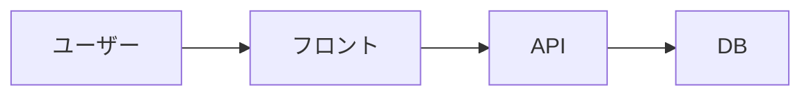

# 〇〇を作ってみた：技術スタックと実装で詰まったポイント

## はじめに

:::note info
当記事は生成AIによって執筆しています。内容の正確性には十分注意を払っていますが、誤った情報が含まれている可能性があります。実際にご利用の際は、公式ドキュメント等もあわせてご確認ください。
:::

個人開発で〇〇というアプリを作りました。本記事では使った技術スタックと、実装中に詰まったポイント・学んだことを共有します。

**対象読者**

- 〇〇のような個人開発を考えている方
- 同じ技術スタックを検討中の方

**この記事のゴール**

- 〇〇のような構成での実装イメージが掴める
- ハマりポイントを事前に回避できる

## 作ったもの

- **名前**：〇〇
- **何ができるか**：〇〇
- **URL**：[〇〇](URL)
- **リポジトリ**：[GitHub](URL)

### スクリーンショット

（画像）

### デモ

（GIF or 動画リンク）

## なぜ作ったか

（動機を簡潔に。「○○が不便だった」「○○を勉強したかった」など）

## 技術スタック

| カテゴリ | 採用技術 | 選定理由 |
|---|---|---|
| フロントエンド | 〇〇 | 〇〇 |
| バックエンド | 〇〇 | 〇〇 |
| DB | 〇〇 | 〇〇 |
| 認証 | 〇〇 | 〇〇 |
| ホスティング | 〇〇 | 〇〇 |
| その他 | 〇〇 | 〇〇 |

### 構成図



## 主要機能の実装

### 機能1: 〇〇

**やったこと**：〇〇

```〇〇:src/path/to/file.ts
// 主要部分のコード
```

**ポイント**：〇〇

### 機能2: 〇〇

```〇〇:src/path/to/file.ts
// コード
```

### 機能3: 〇〇

```〇〇:src/path/to/file.ts
// コード
```

## 詰まったポイント

### 詰まり1: 〇〇でつまずいた

**症状**：〇〇

**原因**：〇〇

**解決策**：

```〇〇
// 解決コード
```

### 詰まり2: 〇〇

**症状**：〇〇

**解決策**：〇〇

## 工夫した点

- 〇〇：〇〇の理由で〇〇した
- 〇〇：〇〇

## やらなかった／諦めたこと

- 〇〇：理由は〇〇
- 〇〇：理由は〇〇

## 開発を通して学んだこと

- 〇〇
- 〇〇

## 今後やりたいこと

- 〇〇
- 〇〇

## まとめ

- 〇〇を〇〇の構成で作った
- 詰まったポイントは〇〇と〇〇
- 次は〇〇を改善したい

触ってフィードバックをいただけると嬉しいです。

## 参考

- [〇〇 公式ドキュメント](URL)
- [参考にした記事](URL)
